# FLOWCHART: Box Security Monitoring System (ESP32)

## 🔄 Complete System Flowchart

---

## 📱 Telegram Message Handler Flowchart

---

## 🚪 Box Opened Detection Flowchart

---

## 📐 Motion Detection Flowchart

---

## 🔐 System State Diagram

```mermaid
stateDiagram-v2
    [*] --> Initializing: Power ON
    
    Initializing --> Armed: Setup Complete<br/>Default Mode
    
    Armed --> Sleep: /disarm or /sleep<br/>Command
    Sleep --> Armed: /arm Command
    
    Armed --> BreachActive: Box Opened<br/>OR Motion Detected
    
    BreachActive --> BreachActive: Alert Every 30s<br/>Until /safe
    BreachActive --> Armed: /safe Command<br/>Reset Breach Flag
    
    Sleep --> Sleep: Sensor NOT Read<br/>WiFi Active<br/>Bot Check 5s
    Armed --> Armed: Sensor Read 50ms<br/>Bot Check 1s
    
    note right of Armed
        ✅ Read sensors
        ✅ Send alerts
        ✅ Monitor box
        ⚡ High power
    end note
    
    note right of Sleep
        ❌ No sensor read
        ✅ WiFi connected
        ✅ Receive commands
        🔋 Low power
    end note
    
    note right of BreachActive
        🚨 Persistent alerts
        📢 Until /safe sent
        🔓 Security compromised
    end note
```

---

## 🔄 Alert Flow Decision Tree

```mermaid
graph TD
    AlertStart([Alert Trigger]) --> CheckArmed{System<br/>Armed?}
    
    CheckArmed -->|No - SLEEP| NoAlert[No Alert Sent<br/>Sensors Not Read]
    CheckArmed -->|Yes - ARMED| CheckWiFi{WiFi<br/>Connected?}
    
    CheckWiFi -->|No| LogOnly[Log to Serial<br/>Only]
    CheckWiFi -->|Yes| CheckEventType{Event<br/>Type?}
    
    CheckEventType -->|Box Opened| CheckBreachFlag{Security<br/>Breached?}
    CheckEventType -->|Motion| CheckMotionActive{Motion<br/>Active?}
    CheckEventType -->|Box Closed| SilentLog[Silent - Log Only<br/>No Alert]
    CheckEventType -->|Motion Stopped| SilentLog
    
    CheckBreachFlag -->|Yes - PRIORITY| CheckBreachInterval{Breach Alert<br/>Interval OK?}
    CheckBreachInterval -->|Yes - 30s passed| SendBreachAlert[🚨 Send Security<br/>Breach Alert]
    CheckBreachInterval -->|No - Wait| NoAlert
    
    CheckBreachFlag -->|No - First Time| SendOpenAlert[📬 Send Box<br/>Opened Alert]
    SendOpenAlert --> SetBreachFlag[Set securityBreached<br/>= true]
    
    CheckMotionActive -->|First Motion| SendMotionAlert[⚠️ Send Motion<br/>Alert]
    CheckMotionActive -->|Ongoing| CheckMotionCooldown{Cooldown<br/>5s Passed?}
    CheckMotionCooldown -->|Yes| SendMotionAlert
    CheckMotionCooldown -->|No| NoAlert
    
    SendBreachAlert --> AlertEnd([End])
    SetBreachFlag --> AlertEnd
    SendMotionAlert --> AlertEnd
    SilentLog --> AlertEnd
    LogOnly --> AlertEnd
    NoAlert --> AlertEnd
```

---

## 📊 Timing & Intervals Diagram

---

## 🎯 Complete System Architecture

---

## 🔢 Code Execution Flow (Detailed)

```mermaid
sequenceDiagram
    participant User
    participant Telegram
    participant ESP32
    participant Sensors
    participant Serial
    
    Note over ESP32: STARTUP SEQUENCE
    ESP32->>Serial: Print Header
    ESP32->>Sensors: Initialize Pins
    ESP32->>ESP32: Connect WiFi
    ESP32->>Telegram: Setup SSL Certificate
    ESP32->>Telegram: Send Startup Message
    Telegram->>User: 🤖 System Active
    
    Note over ESP32: MAIN LOOP (ARMED)
    loop Every 50ms
        ESP32->>Sensors: Read Hall & Tilt
        Sensors-->>ESP32: Sensor Values
        ESP32->>Serial: Display Status
        
        alt Box Opened Detected
            ESP32->>ESP32: Set Breach Flag
            ESP32->>Telegram: Send Open Alert
            Telegram->>User: 🚨 Box Opened!
        end
        
        alt Motion Detected
            ESP32->>Telegram: Send Motion Alert
            Telegram->>User: ⚠️ Motion Detected!
        end
    end
    
    loop Every 1s (Armed)
        ESP32->>Telegram: Check Messages
        User->>Telegram: /status
        Telegram->>ESP32: Forward Command
        ESP32->>Telegram: Send Status Info
        Telegram->>User: 📊 System Status
    end
    
    User->>Telegram: /sleep
    Telegram->>ESP32: Sleep Command
    
    Note over ESP32: SLEEP MODE
    ESP32->>Serial: Sleep Mode Log
    ESP32->>ESP32: Skip Sensor Reading
    
    loop Every 5s (Sleep)
        ESP32->>Telegram: Check Messages
    end
    
    User->>Telegram: /arm
    Telegram->>ESP32: Arm Command
    
    Note over ESP32: BACK TO ARMED MODE
    ESP32->>Telegram: System Armed
    Telegram->>User: ✅ Armed
```

---

## 📋 Summary

### Key Components:
1. **Initialization**: GPIO setup, WiFi connection, Telegram setup
2. **Main Loop**: Armed vs Sleep mode decision
3. **Sensor Reading**: Hall (box open) & Tilt (motion) detection
4. **Alert System**: Persistent breach alerts, motion alerts
5. **Telegram Integration**: Remote control and notifications
6. **Power Management**: Sleep mode for energy efficiency

### Critical Paths:
- **Breach Detection**: Box opened → Set flag → Alert until /safe
- **Motion Detection**: Tilt change → Alert → Wait stable (3s)
- **Sleep Mode**: No sensor read → WiFi active → Command response only
- **WiFi Management**: Auto-reconnect every 30s if disconnected

### Timing Constants:
- Armed sensor read: **50ms**
- Armed bot check: **1s**
- Sleep bot check: **5s**
- Motion stable: **3s**
- Alert interval: **30s**
- Motion cooldown: **5s**
